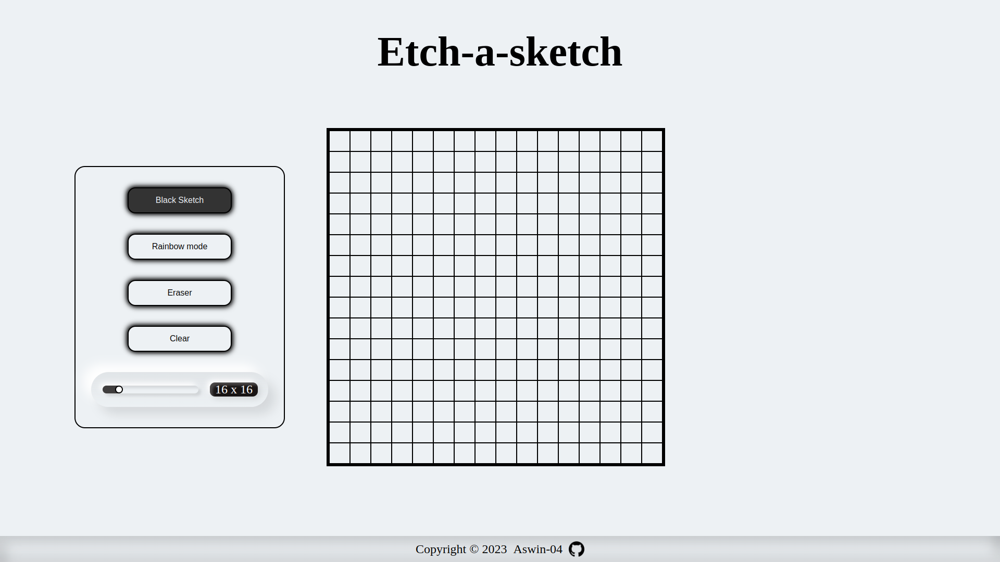

# Etch-a-Sketch



This project is part of The Odin Project's Foundation Course, designed to enhance your skills in working with the Document Object Model (DOM) using JavaScript.

## Project Overview

Etch-a-Sketch is a simple web-based drawing application that allows users to draw on a canvas by hovering their mouse over it. The user can choose the size of the canvas and clear it to start over. This project aims to reinforce your understanding of DOM manipulation and event handling in JavaScript.

## Features

- Create a customizable canvas with a grid of squares.
- Draw on the canvas by hovering the mouse over it.
- Choose the canvas size.
- Clear the canvas to start over.

## Usage

To use this Etch-a-Sketch application, follow these steps:

1. Visit the [Live Demo](https://aswin-04.github.io/Etch-a-sketch/) to interact with the application directly.

2. Alternatively, you can clone this repository and open the `index.html` file in your web browser.

## Development

To work on this project locally or further customize it, follow these steps:

1. Clone this repository:

   ```bash
   git clone https://github.com/Aswin-04/Etch-a-sketch.git

## Acknowledgments
- This project was created as part of The Odin Project's Foundation Course.
- Special thanks to the open-source community for providing resources and      inspiration.

